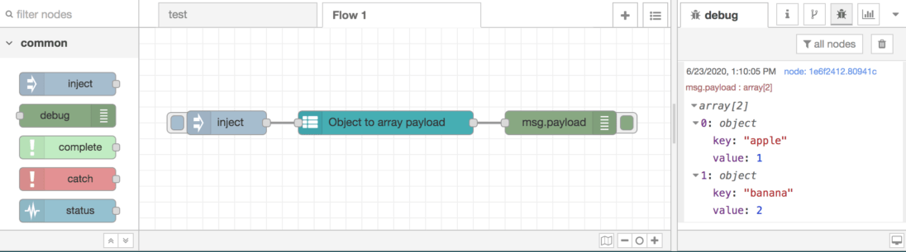

# Object to Array

Given an object input, when this node is executed it will transform its properties to an array of objects with specified key/value properties to the succeeding connected node(s).

## Install

> Note: Once public, as with other Node-RED packages this package will be installable through the Node-RED UI. Until then, be sure you follow the [developer instructions](https://gitlab.com/tmobile/iot-mobile/kit/-/blob/tmo/master/developers.md) **before** you try to install any private T-Mobile NPM packages.

<!-- TODO: Once package is public, update instructions -->

```
cd ~/.node-red
npm install --save node-red-contrib-object-to-array
```

## Usage

Drag and Drop the "Object to Array" onto the canvas. Set the `Input` value to the source object and the `output` value to the destination property. Optionally, you can change the key and value labels to override the defaults.

### Example

The [example](./example-flow.json) transforms an example object into an array then stops. To see it in action, [import it](https://nodered.org/docs/user-guide/editor/workspace/import-export) into your Node-RED project.


